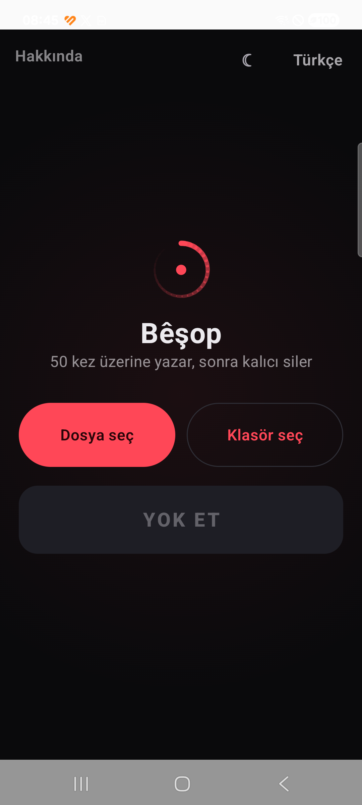
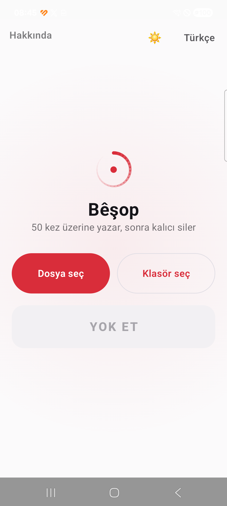
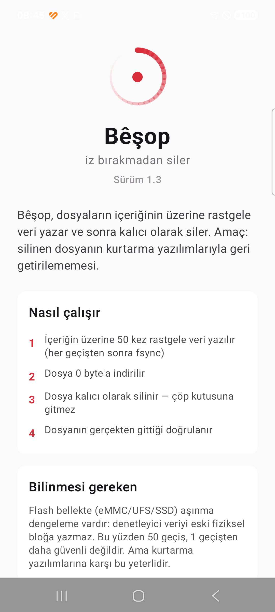

<div align="center">


# Bêşop

**iz bırakmadan siler** · *bêyî şop jê dibe* · *erases without a trace*

Dosyanın içeriğinin üzerine 50 kez rastgele veri yazar, sonra kalıcı olarak siler.
Amaç: silinen dosyanın kurtarma yazılımlarıyla geri getirilememesi.

Android · Windows · macOS · Linux
Kurmancî · کوردیی ناوەندی · العربية · Türkçe · English

</div>

---

## Neden

Bir dosyayı sildiğinde işletim sistemi içeriği yok etmez — sadece "burası artık
boş" diye işaretler. Baytlar diskte olduğu gibi durur. Kurtarma yazılımları
(DiskDigger, Recuva, PhotoRec) tam olarak bunu bulur.

Bêşop silmeden **önce** içeriği yok eder.

## Nasıl çalışır

Sıra önemli — her adım bir öncekinin bıraktığı izi kapatır:

1. İçeriğin üzerine **50 kez rastgele veri** yazılır
2. Her geçişten sonra `fsync` — veri disk önbelleğinde beklemez, gerçekten diske iner
3. Dosya **0 byte'a** indirilir
4. **Kalıcı olarak silinir** — çöp kutusuna gitmez
5. Silmenin gerçekleştiği **doğrulanır**; olmadıysa uygulama bunu açıkça söyler

Masaüstünde ek olarak dosya adı silmeden önce üç kez rastgeleye çevrilir, böylece
dizin kaydındaki eski isim de bozulur.

### Test kanıtı

30 MB'lık bir dosyanın içine tanınabilir bir imza yazılıp Bêşop çalıştırıldı.
İlk 16 bayt işlem boyunca dışarıdan izlendi:

| Aşama | Dosyanın ilk baytları |
|---|---|
| Silmeden önce | `GIZLIVERI-CYBERG` |
| İşlem sırasında | `9e 87 4c 14 74 8a fc f0` |
| Sonra | `No such file or directory` |

## Dürüst sınır

Flash bellekte (eMMC / UFS / SSD) **aşınma dengeleme** vardır: denetleyici
yazdığın veriyi eski fiziksel bloğa değil, başka bir bloğa yazar. Eski bloktaki
kopya çipin içinde kalır ve yazılım oraya erişemez.

**Yani 50 geçiş, 1 geçişten daha güvenli değildir.** Bunu uygulamanın içinde de
yazıyoruz. Ama kurtarma yazılımlarına karşı bu yeterlidir — dosya sistemi
seviyesinde içerik gerçekten yok edilir, ve uygulamanın amacı budur.

Laboratuvar düzeyinde mutlak garanti isteyen bir senaryoda tek yol tam disk
şifreleme ve anahtar imhasıdır.

> **Not:** Galeri fotoğrafı silerken Google Fotoğraflar / Files gibi uygulamaların
> kendi çöp kutusunda ayrı bir kopya kalabilir. Onu ilgili uygulamadan ayrıca
> temizlemek gerekir.

## Ekran görüntüleri

<div align="center">



</div>

## Özellikler

- **Üç düğme** — Dosya seç, Klasör seç, Yok et. Başka ayar yok.
- **Beş dil**, ana dil Kurmancî. Sağdan sola diller tam destekli (gerçek RTL yerleşim).
- **Aydınlık / karanlık / sistem** teması.
- **İnternet izni yok** — uygulama isteseydi bile hiçbir yere veri gönderemez.
- Reklam yok, takip yok, analitik yok, hesap yok.
- **Disk modu** (masaüstü) — USB bellek / SD kart / harici diski tamamen
  biçimlendirip 3 geçiş yazdırır. Sistem diski kilitlidir.
- İşlem arka planda sürer, bildirimle ilerleme gösterir (Android).

## Kurulum

Hazır dosyalar için [Releases](../../releases) sayfasına bak.

| Platform | Dosya |
|---|---|
| Android 8.0+ | `Besop-Android-*.apk` |
| Windows 10/11 | `Besop-Windows-Kurulum-*.msi` (kurulum) veya `*-Portable-*.zip` (kurulumsuz) |
| macOS | `Besop-macOS-*.dmg` |

> macOS uygulaması imzasız olduğu için ilk açılışta engellenebilir:
> sağ tık → **Aç**, ya da Sistem Ayarları → Gizlilik ve Güvenlik → **Yine de Aç**.

## Kaynaktan derleme

Gereken: **JDK 17**, Android için ayrıca **Android SDK** (compileSdk 34).

```bash
./gradlew :app:assembleRelease          # Android APK
./gradlew :desktop:packageMsi           # Windows kurulum (.msi)
./gradlew :desktop:packageDmg           # macOS (.dmg) — sadece Mac üzerinde
./gradlew :desktop:createDistributable  # taşınabilir klasör
./gradlew :desktop:run                  # masaüstünü doğrudan çalıştır
./gradlew :desktop:selftest             # silme motorunu doğrula
```

`jpackage` çapraz derleme yapamaz: her platformun paketi kendi işletim sisteminde
üretilir. GitHub Actions bunu üç platformda birden yapar — aşağıya bak.

### İmzalı derleme

İmza anahtarı depoda tutulmaz. İmzalı APK üretmek için:

```bash
cp keystore.properties.example keystore.properties
# içindeki değerleri kendi anahtarınla doldur
```

`keystore.properties` yoksa derleme yine çalışır, sadece debug anahtarıyla imzalanır.

## Proje yapısı

```
shared/src/    Android + masaüstü ORTAK kod
  Strings.kt       5 dilin tüm metinleri — tek kaynak
  Model.kt         veri modeli, ilerleme durumu
  Theme.kt         renk paleti, tema modu
  WipeUi.kt        ana ekranın tamamı
  WipeAnimation.kt silme animasyonu
  Logo.kt          logo ve CyberGah damgası
  Splash.kt        açılış animasyonu
  About.kt         hakkında ekranı

app/           Android'e özel
  WipeEngine.kt    SAF tabanlı silme motoru
  WipeService.kt   ön plan servisi + bildirim
  Picker.kt        dosya/klasör seçici

desktop/       Masaüstüne özel
  DesktopEngine.kt dosya sistemi silme motoru
  DiskWipe.kt      disk silme (işletim sistemi araçlarıyla)
  DiskScreen.kt    disk seçme ekranı

brand/         Logo dosyaları (SVG + PNG)
store/         Mağaza ve duyuru metinleri
```

Arayüz ve çeviriler tek kaynaktan gelir. Bir dili düzeltmek için
`shared/src/com/cybergah/securewipe/Strings.kt` yeter — iki platform da alır.

## Katkı

Kurmancî ve Soranî çevirileri gözden geçirilmeye açıktır. Düzeltmen varsa
`Strings.kt` içinde tek satır değişiyor — issue aç ya da PR gönder.

## Lisans

[MIT](LICENSE)

---

<div align="center">
<sub>C Y B E R G A H</sub>
</div>
